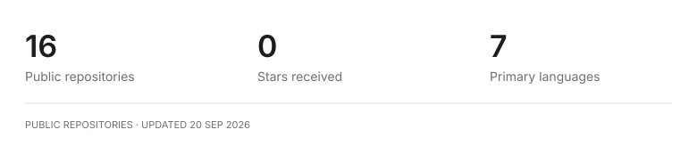

# Mahmoud Berkoti

### Security research & engineering.

Security Engineering Intern at **Tesla**. Computer Science at **Carleton University**.

I find vulnerabilities, test how systems fail, and build tools to help defend them. My work spans application security, adversarial AI testing, and low-level security tooling.

[Portfolio ↗](https://berkotidev.vercel.app/) &nbsp; · &nbsp; [LinkedIn ↗](https://www.linkedin.com/in/mahmoud-berkoti-752841274/) &nbsp; · &nbsp; [Email ↗](mailto:M.berkoti@gmail.com)

---

## Selected work

| Project | Focus | Stack |
| :--- | :--- | :--- |
| **[Bastion](https://github.com/Mahmoud-Berkoti/Bastion)** | Packet filtering at the network driver with eBPF/XDP. | C · Go · eBPF |
| **[Vigil](https://github.com/Mahmoud-Berkoti/Vigil)** | BGP route monitoring for hijacks, leaks, and invalid announcements. | C · SQLite · Prometheus |
| **[Fuzzor](https://github.com/Mahmoud-Berkoti/Fuzzor)** | Adversarial testing for prompt injection, jailbreaks, and data leakage. | Python · FastAPI · Ollama |
| **[Fracture](https://github.com/Mahmoud-Berkoti/Fracture)** | Offensive API testing for authorization and business-logic flaws. | Python · httpx · asyncio |

## Toolkit

**Build** &nbsp; C/C++ · Python · Go · Rust · TypeScript 
**Test** &nbsp; SAST/DAST · Threat modeling · LLM security · Fuzzing 
**Investigate** &nbsp; Linux · Wireshark · eBPF · SIGMA · Azure Sentinel

More about my work

- **Application security:** exploit validation, memory-safety bugs, authorization flaws, and secret detection.
- **AI security:** adversarial inputs, prompt injection, and detection engineering.
- **Cloud security:** least-privilege IAM, Kubernetes hardening, and policy-gated delivery.
- **Education:** Bachelor of Computer Science at Carleton University, expected December 2027.

## On GitHub

<picture>
  <source media="(prefers-color-scheme: dark)" srcset="assets/activity-dark.svg">
  
</picture>

Real public-repository data, refreshed daily. Forks are excluded. [How this works](scripts/update_activity.py).
