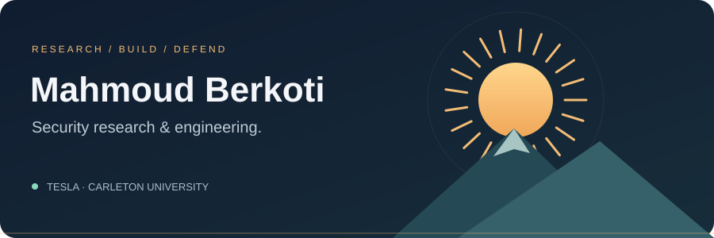
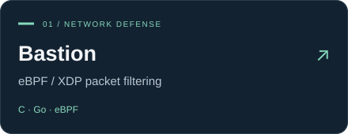
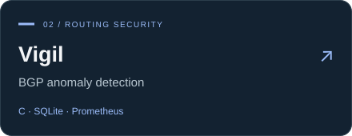
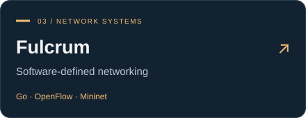
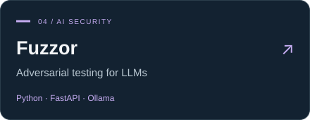

<a href="https://berkotidev.vercel.app/">Portfolio ↗</a> &nbsp; / &nbsp; <a href="https://www.linkedin.com/in/mahmoud-berkoti-752841274/">LinkedIn ↗</a> &nbsp; / &nbsp; <a href="mailto:M.berkoti@gmail.com">Get in touch ↗</a>

Security Engineering Intern at **Tesla**, studying Computer Science at **Carleton University**. I find vulnerabilities, test how systems fail, and build tools to help defend them.

### Selected work

Also building **[Fracture](https://github.com/Mahmoud-Berkoti/Fracture)** — offensive API testing for authorization and business-logic flaws.

### Toolkit

**Build** &nbsp; C/C++ · Python · Go · Rust · TypeScript 
**Test** &nbsp; SAST/DAST · Threat modeling · LLM security · Fuzzing 
**Investigate** &nbsp; Linux · Wireshark · eBPF · SIGMA · Azure Sentinel

More about my work

- **Application security:** exploit validation, memory-safety bugs, authorization flaws, and secret detection.
- **AI security:** adversarial inputs, prompt injection, and detection engineering.
- **Cloud security:** least-privilege IAM, Kubernetes hardening, and policy-gated delivery.
- **Education:** Bachelor of Computer Science at Carleton University, expected December 2027.

### In the open

<picture>
  <source media="(prefers-color-scheme: dark)" srcset="assets/activity-dark.svg?v=2">
  
</picture>

Generated daily from public repositories. Forks excluded. [View the source](scripts/update_activity.py).
